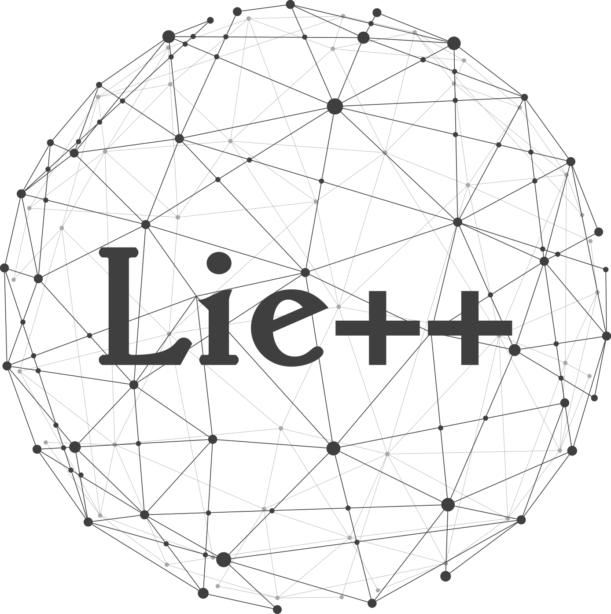

# Equivariant Preintegration

[](./LICENSE)




Maintainer: [Giulio Delama](mailto:giulio.delama@aau.at)

- [Description](#description)
- [Installation](#installation)
- [Usage](#usage)
- [Credit](#credit)
  * [License](#license)
  * [Usage for academic purposes](#usage-for-academic-purposes)

## Description

This is a header-only C++ library based on Eigen for equivariant Inertial Measurement Unit (IMU) preintegration, a fundamental building
block that can be leveraged in different optimization-based Inertial Navigation System (INS) localization solutions.

## Installation

This is a header-only C++ library meant to be used within other projects. Either copy the content of `include` folder within the external project's `include` folder or use cmake's `FetchContent_Declare` as follows
```
FetchContent_Declare(
    EquivariantPreintegration
    GIT_REPOSITORY  https://github.com/aau-cns/equivariant-preintegration
    GIT_TAG         main
    GIT_SHALLOW     TRUE
    GIT_PROGRESS    TRUE
)
list(APPEND external EquivariantPreintegration) 
list(APPEND include_dirs ${EQUIVARIANT_PREINTEGRATION_INCLUDE_DIR})
list(APPEND libs EquivariantPreintegration Eigen3::Eigen)
```
## Usage

## Credit
This code was written within the [Control of Networked System (CNS)](https://www.aau.at/en/smart-systems-technologies/control-of-networked-systems/), University of Klagenfurt.

### License
This software is made available to the public to use (_source-available_), licensed under the terms of the BSD-2-Clause-License with no commercial use allowed, the full terms of which are made available in the `LICENSE` file. No license in patents is granted.

### Usage for academic purposes
If you use this software in an academic research setting, please cite the corresponding paper.

```latex
@article{delama2024equivariant,
  title={Equivariant IMU Preintegration with Biases: a Galilean Group Approach},
  author={Delama, Giulio and Fornasier, Alessandro and Mahony, Robert and Weiss, Stephan},
  journal={arXiv preprint arXiv:2411.05548},
  year={2024}
}
```

